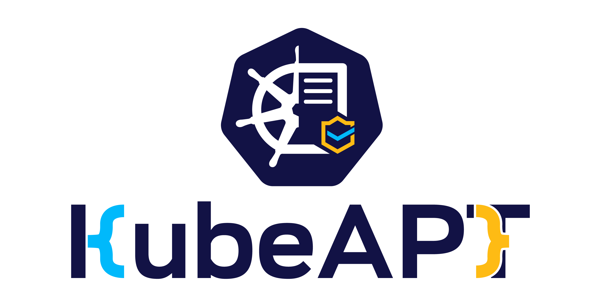

  

  Kubernetes Admission Policy Toolkit

  <a href="https://img.shields.io/badge/license-Apache--2.0-blue.svg">License: Apache-2.0</a>
  <a href="https://img.shields.io/badge/go-1.25.0-00ADD8?logo=go">Go 1.25.0</a>

KubeAPT is a CLI for validating Kubernetes admission hardening. It evaluates ValidatingAdmissionPolicies (VAP) and bindings, checks Pod Security Admission (PSA) posture, and scans clusters for admission safeguards. It also manages policy bundles and standalone policies so you can download, inspect, and apply curated rulesets. Official bundles and policies are published at [https://kolteq.com/policies](https://kolteq.com/policies).

Documentation lives at [https://kubeapt.io](https://kubeapt.io).

## Star History

